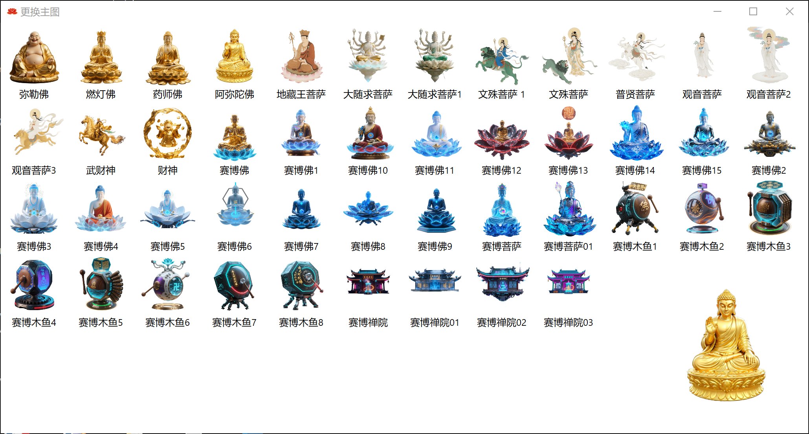
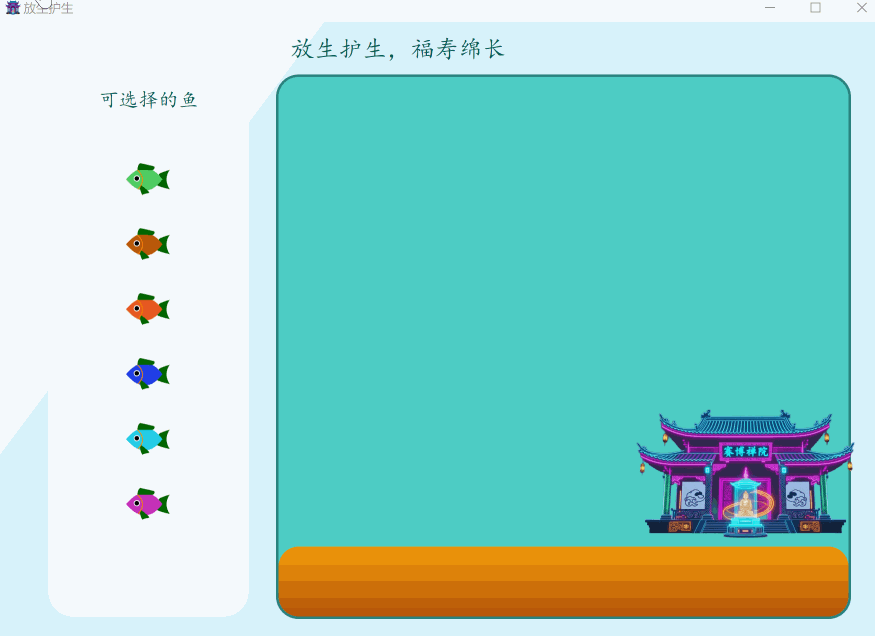
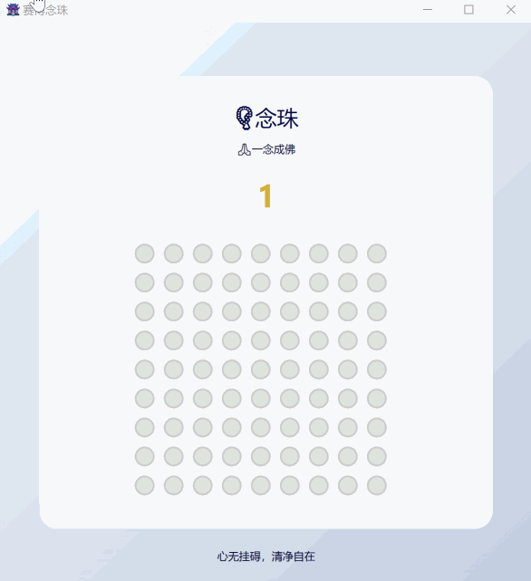
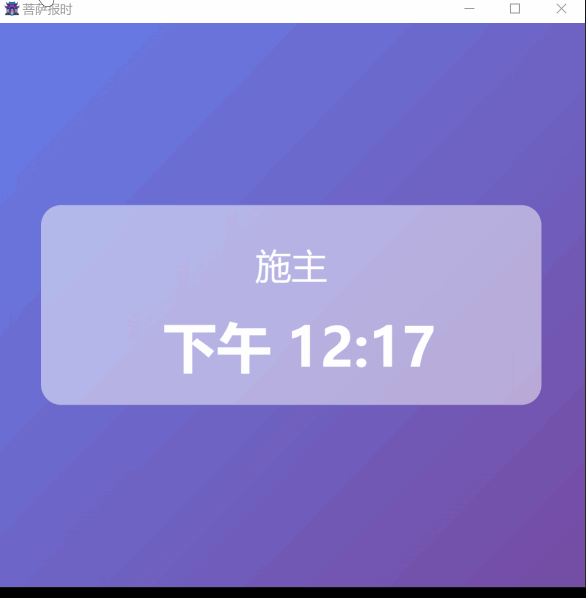
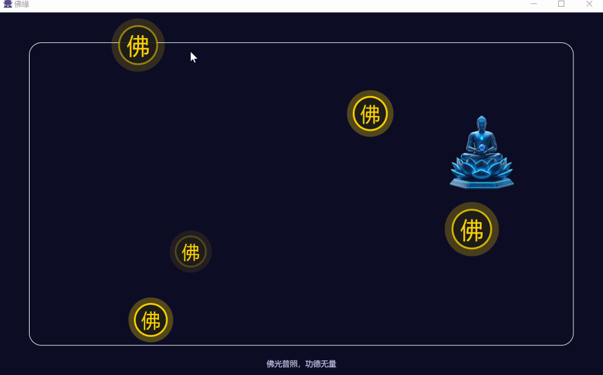
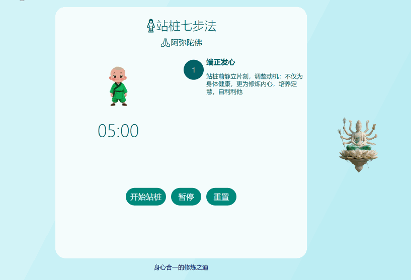

用赛博禅院，学禅宗智慧

赛博禅院是一款赛博朋克和佛经深度结合的window 软件。

具有佛学知识科普、佛堂、电子木鱼等功能。

不用去寺庙就可以上香，添加贡品。拜佛，修行。为了更好的修行，提供了今日功德和功德排名功能。

何时何地都可以修行，精进佛法。佛学永无止境，佛法无边。

更换主图,多种主图供你选择

寺庙介绍

赛博放生

赛博咒语

赛博祈福

赛博念珠
念珠一共81颗，每一颗代表一种磨难。每点亮一颗代表经历过此磨难。历经九九八十一难。方能修成真佛。
一半魔，一半佛。一念成佛。

赛博超度

赛博菩萨整点报时

赛博化缘
心若赛博，亦可成佛

赛博佛缘

赛博佛游

赛博佛魔棋

以心为棋盘，以佛为白子，以魔为黑子。在心中来一场佛魔决。

一念成魔，一念成佛。施主阿弥陀佛

赛博冥想

让紧张的身心得到短暂的放松

赛博站桩

让身体与世界短暂的融合

念诵大悲咒

