用赛博禅院，学禅宗智慧

赛博禅院是一款赛博朋克和佛经深度结合的window 软件。

具有佛学知识科普、佛堂、电子木鱼等功能。

不用去寺庙就可以上香，添加贡品。拜佛，修行。为了更好的修行，提供了今日功德和功德排名功能。

何时何地都可以修行，精进佛法。佛学永无止境，佛法无边。

禅院总览

寺庙介绍

功能总览

基本设置

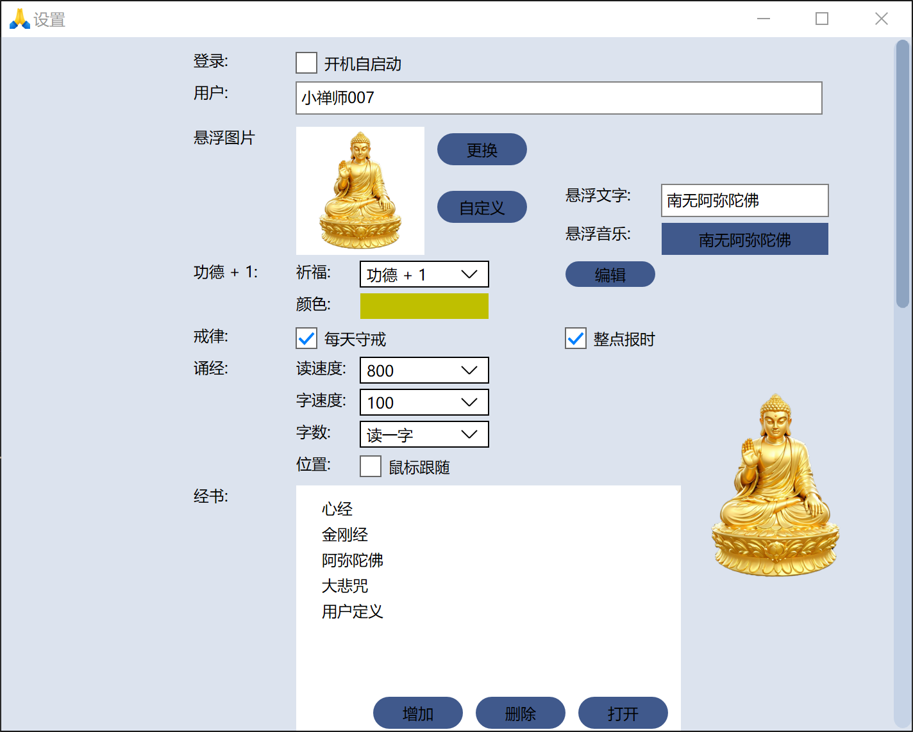

修行记录

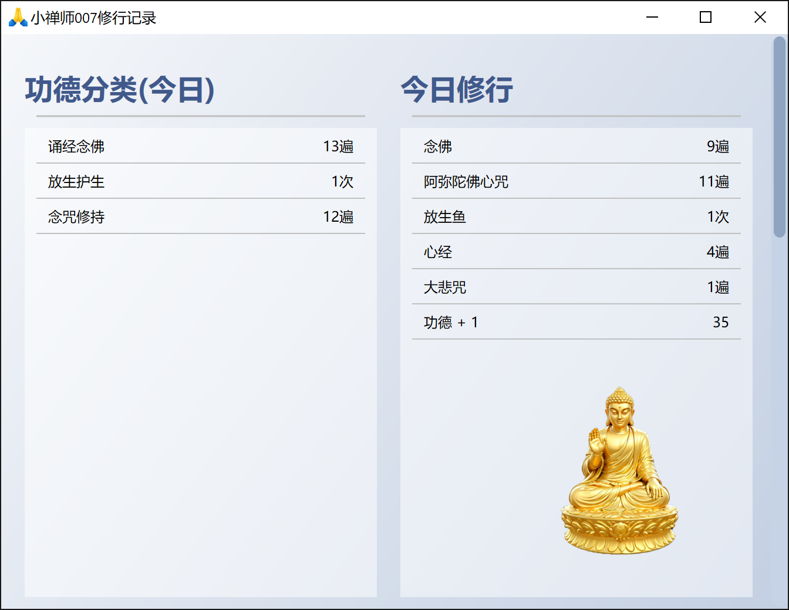

更换主图,多种主图供你选择

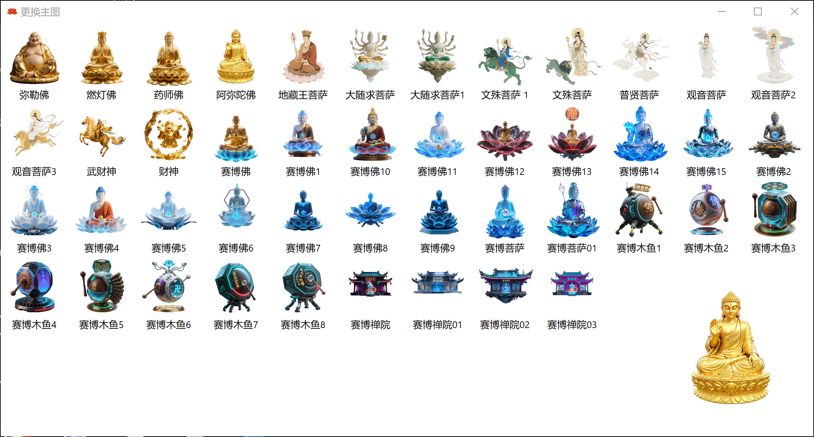

赛博放生

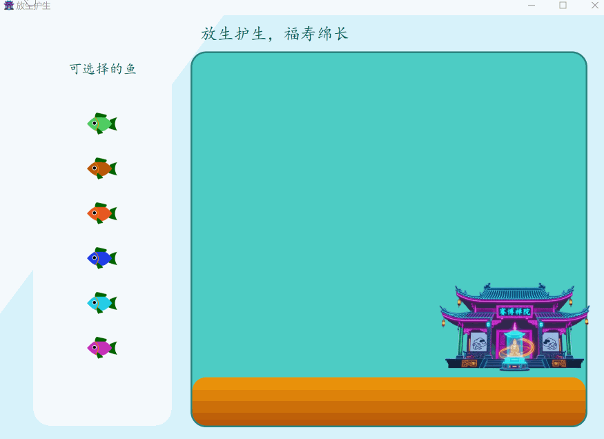

念诵心经

赛博咒语

赛博祈福

转冈仁波齐

赛博念珠
念珠一共81颗，每一颗代表一种磨难。每点亮一颗代表经历过此磨难。历经九九八十一难。方能修成真佛。
一半魔，一半佛。一念成佛。
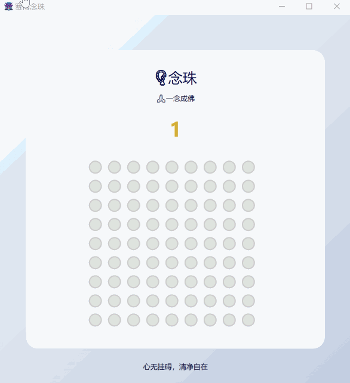

赛博超度

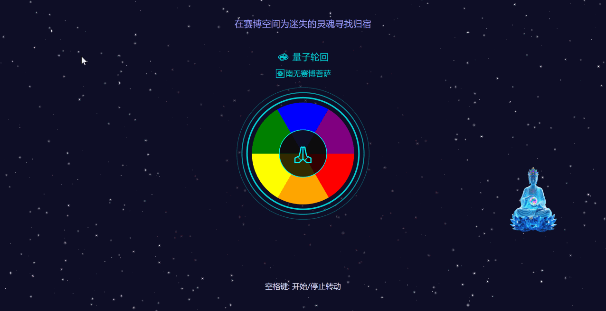

赛博菩萨整点报时

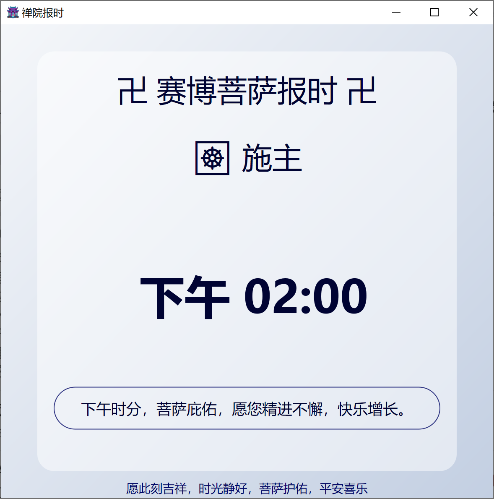

一日素食

赛博化缘
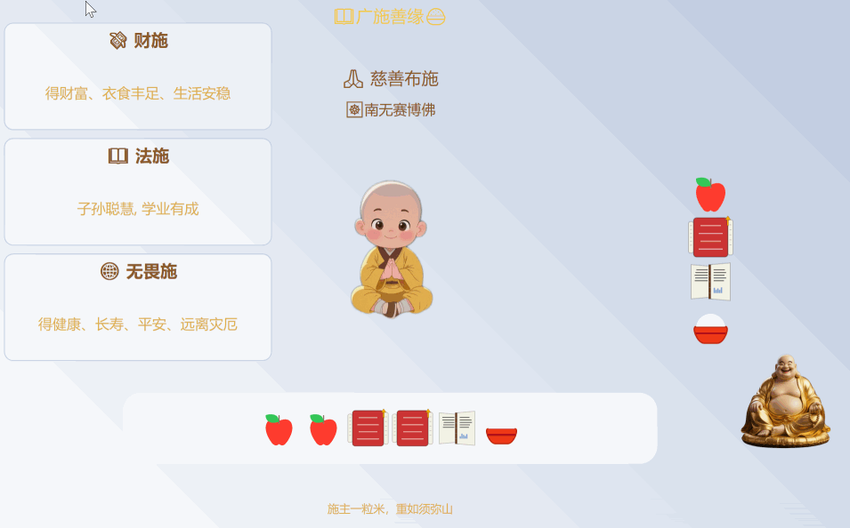

赛博佛缘

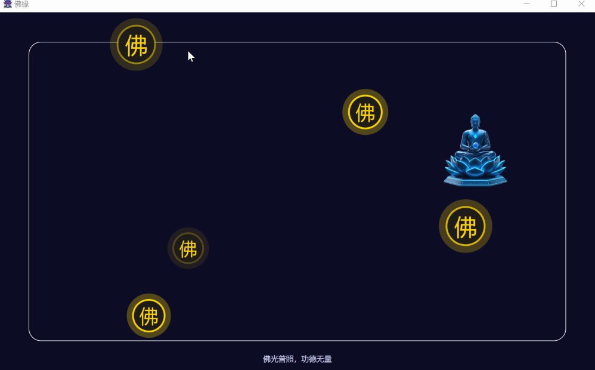

赛博佛游

赛博佛魔棋

以心为棋盘，以佛为白子，以魔为黑子。在心中来一场佛魔决。

一念成魔，一念成佛。施主阿弥陀佛

赛博冥想

让紧张的身心得到短暂的放松

赛博站桩

让身体与世界短暂的融合

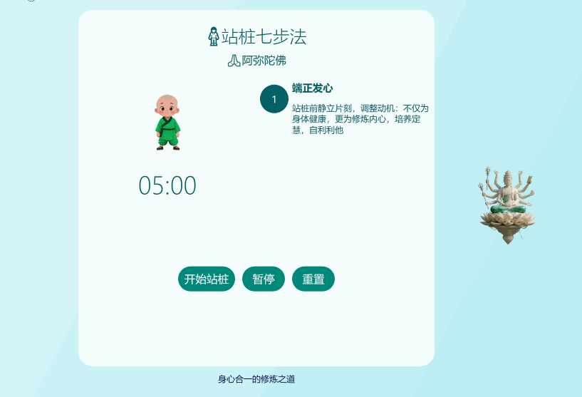

念诵大悲咒

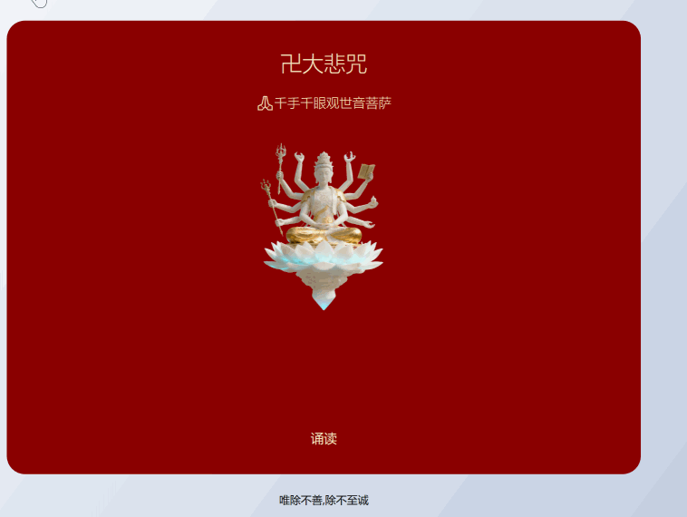

AI解经
本系列以《金刚经》与《心经》的经典偈颂为蓝本，通过“赛博解读”的方式，将古老的佛学智慧投射到现代职业场景中。 
每一条内容均遵循“原文→白话翻译→原意阐释→职业化解读”的结构，旨在用东方哲学观照当代人的工作与生活——无论是医生面对病症、 
厨师料理食材、程序员调试代码，还是化妆师修饰容颜、摄影师捕捉光影，都能从中看到“凡所有相，皆是虚妄”、“应无所住而生其心”等智慧的生动映照。 
这不仅是一次跨界的文本实验，更是一份献给现代人的“职业心经”，希望为忙碌的日常带来片刻的省思与清凉。  

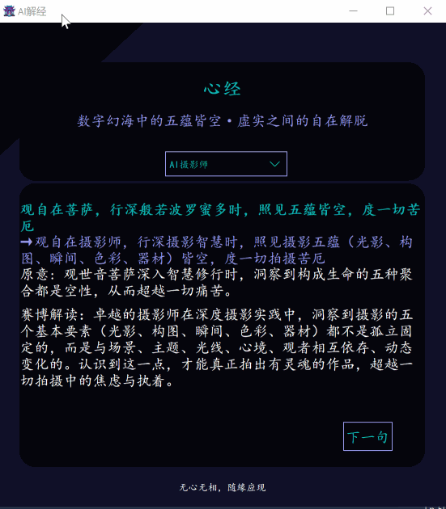

佛偈（fó jì），简称“偈”或“偈语”，是佛教经典中一种独特的文体，源于梵语“Gāthā”（伽陀），意为颂、诗颂或孤起颂。  
它通常以诗歌的形式出现，语言凝练、韵律优美，用于概括佛法义理、表达修行感悟或作为禅宗祖师传法的凭证。  
佛偈百则  
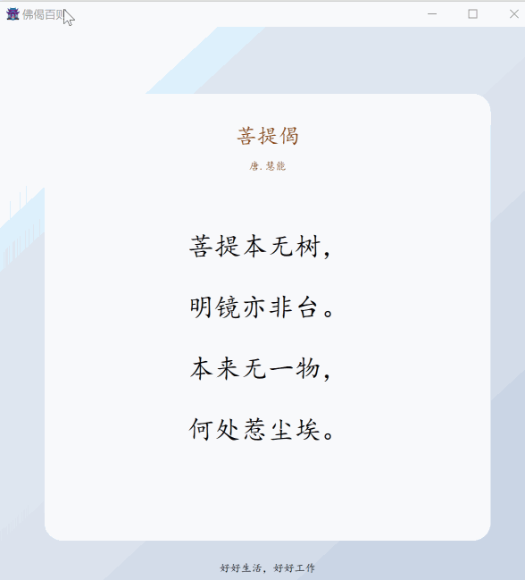

