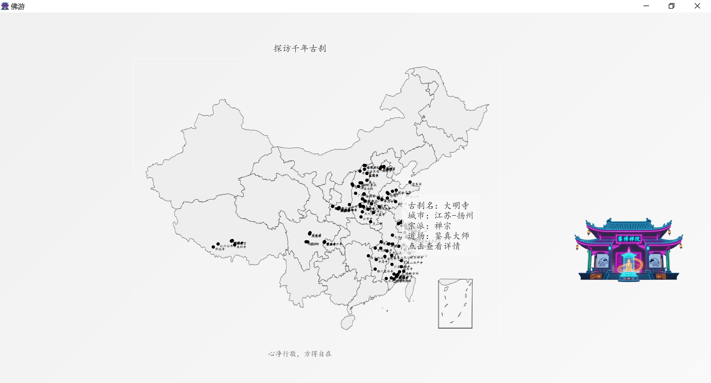
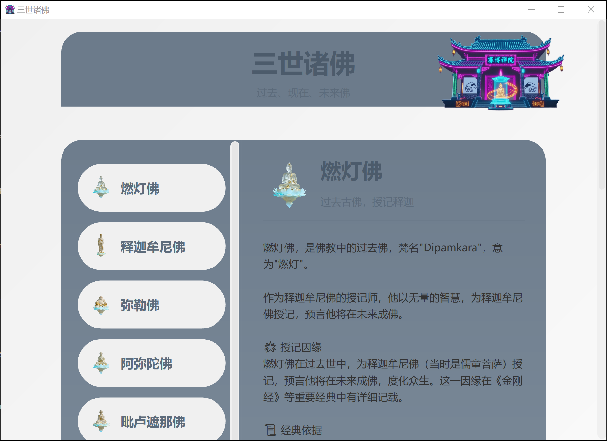
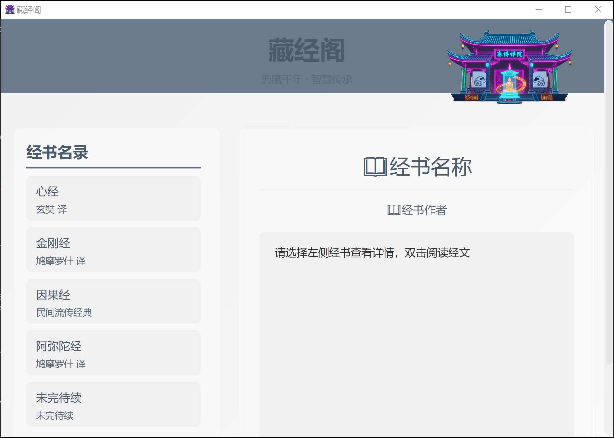
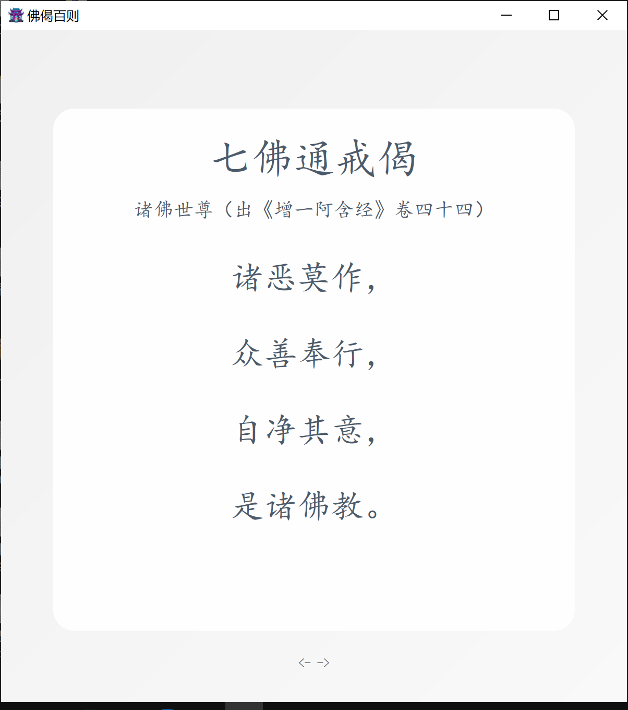
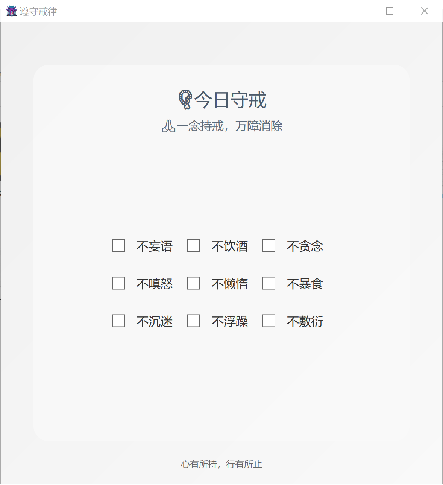
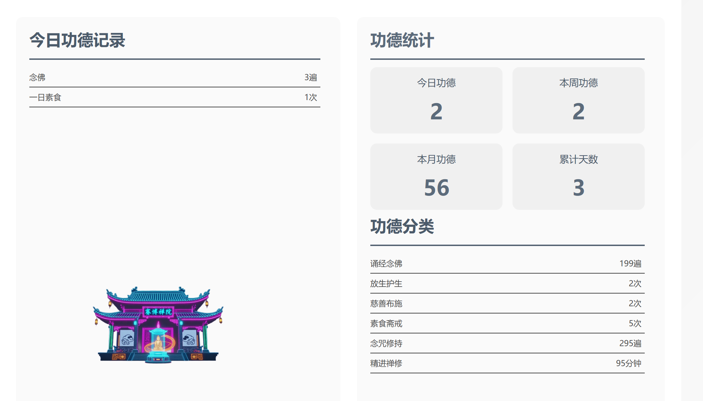
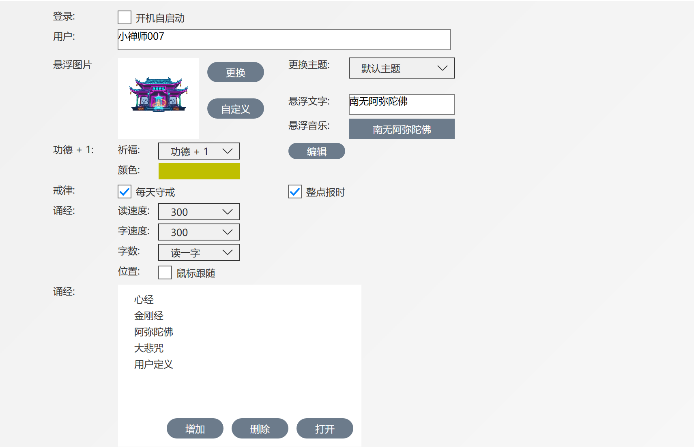

# 赛博禅堂 - 数字时代的禅修伴侣

## 项目简介

赛博禅堂是一个结合传统佛教文化与现代数字技术的禅修应用，旨在为现代人提供便捷、全面的禅修体验。通过数字化手段，让更多人能够接触和了解佛教文化，实践禅修生活。

## 功能模块

### 1. 古刹总览

探索世界各地著名古刹的历史文化与建筑特色，通过精美的图片和详细的介绍，感受佛教建筑的庄严与美感。

### 2. 诸佛介绍

详细介绍佛教中的诸佛菩萨，包括其象征意义、经典故事和信仰内涵，帮助用户更深入地了解佛教文化。

### 3. 藏经阁

数字化的佛教经典宝库，提供各类佛经的阅读与学习，让经典智慧触手可及。

### 4. 佛偈百则

精选百则佛偈，蕴含深刻的人生智慧，每日阅读，修身养性。

### 5. 今日守戒

提供日常持戒提醒与指导，帮助修行者培养良好的行为习惯和道德品质。

### 6. 禅院报时

模拟传统禅院的报时系统，提醒用户按时进行禅修和功课，保持规律的修行生活。

### 7. 功德统计

记录用户的修行活动和功德积累，通过数据可视化展示修行进度，激励持续修行。

### 8. 设置

个性化应用设置，包括提醒时间、界面风格等，根据个人喜好定制修行体验。

### 9. 关于

应用的基本信息、版本说明和开发者介绍，让用户了解应用的背景和理念。

## 设计理念

赛博禅堂融合了传统佛教文化与现代数字技术，以"科技赋能修行"为核心理念，致力于：

- **便捷性**：随时随地进行禅修和学习
- **全面性**：涵盖佛教文化的多个方面
- **互动性**：通过数字手段增强用户体验
- **传承性**：弘扬和传承佛教传统文化

## 使用指南

1. 打开应用后，在主界面选择想要使用的功能模块
2. 对于需要日常使用的功能（如今日守戒、禅院报时），建议在设置中开启提醒
3. 定期使用功德统计功能查看修行进度
4. 利用藏经阁和佛偈百则进行日常学习和反思

## 结语

赛博禅堂希望通过数字化手段，让更多人能够接触、了解和实践佛教文化，在快节奏的现代生活中找到内心的宁静与智慧。愿每一位使用者都能在修行中获得成长与感悟。

---

*愿以此功德，庄严佛净土。上报四重恩，下济三途苦。*