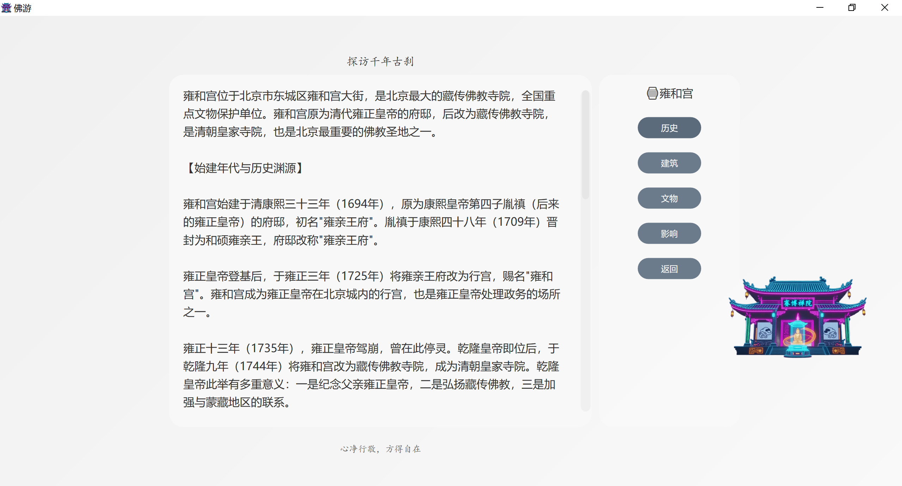
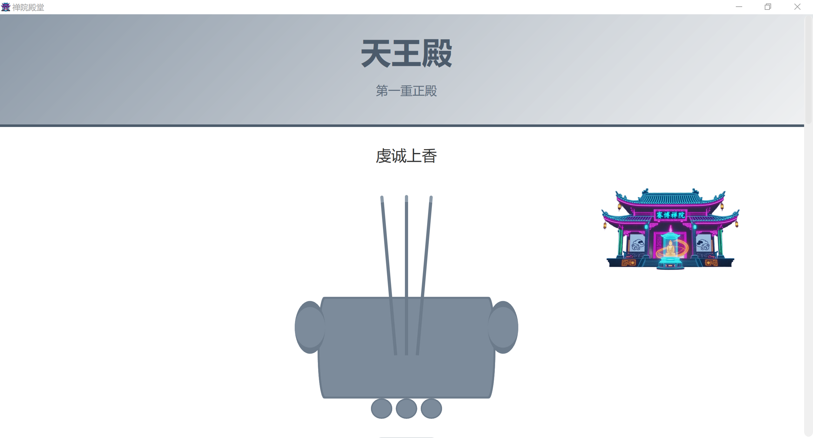
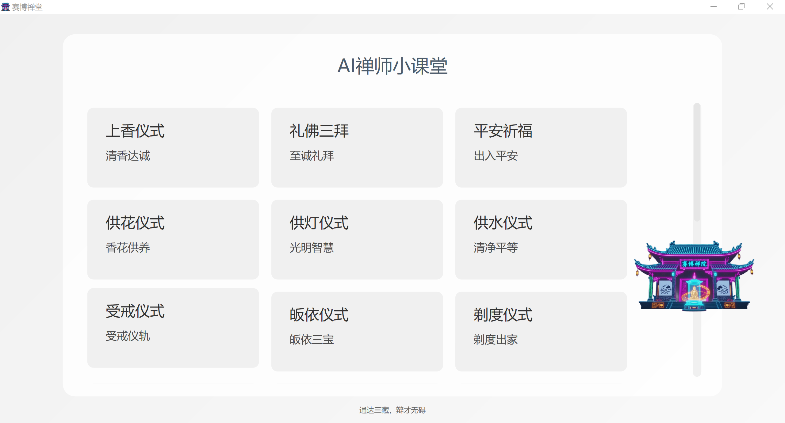
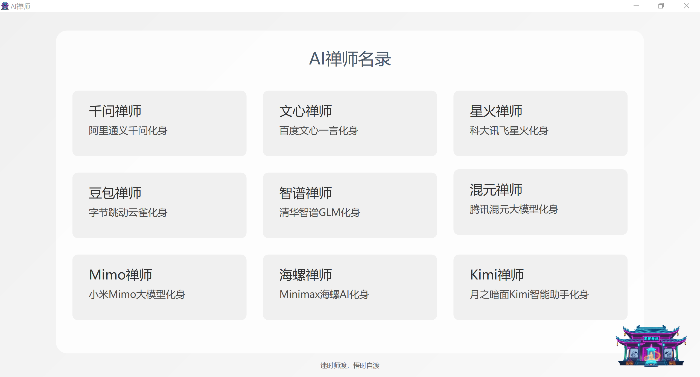
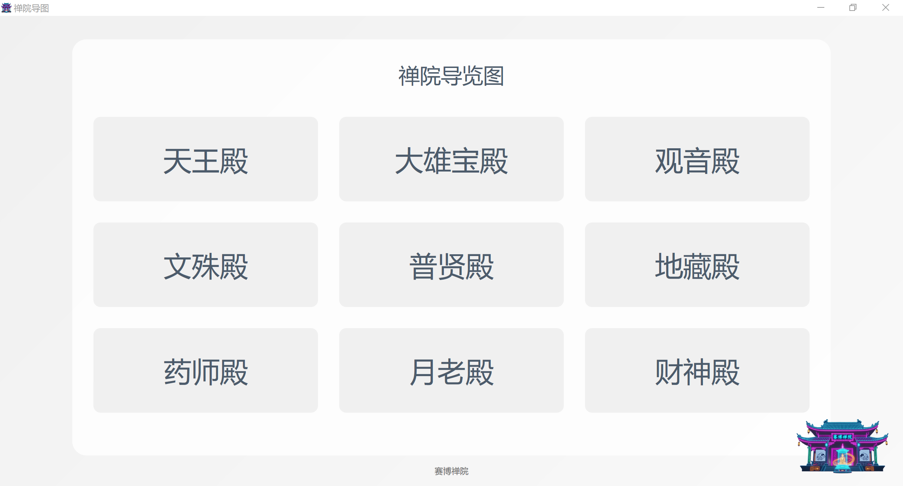
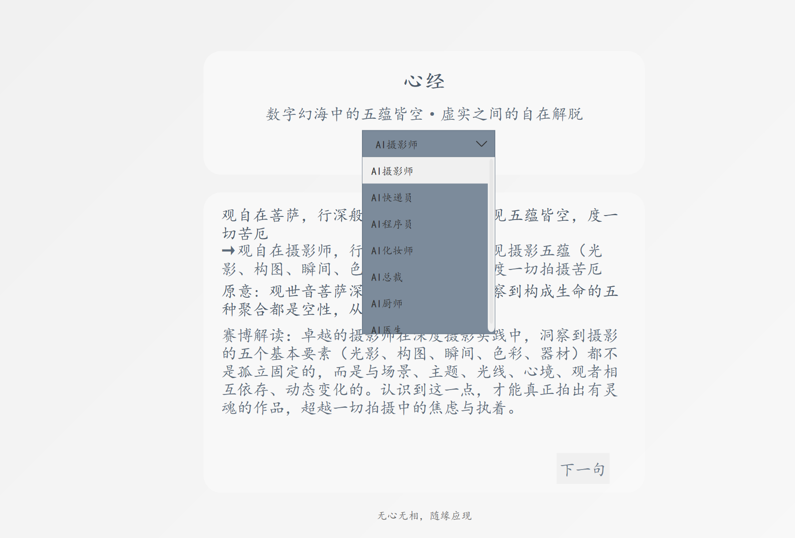
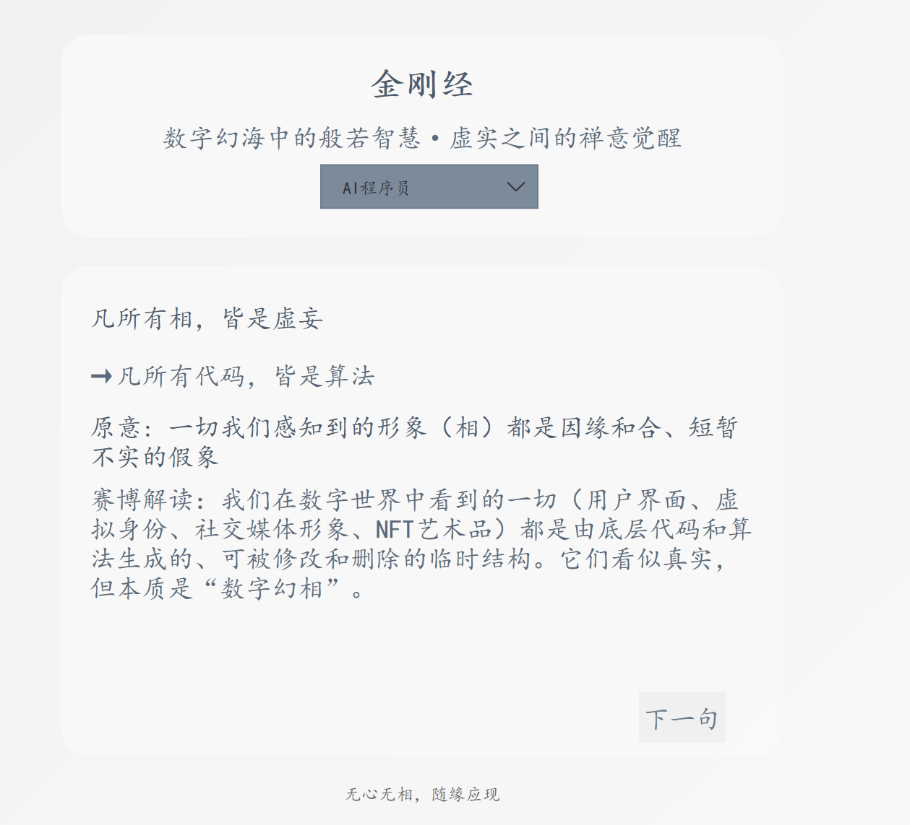
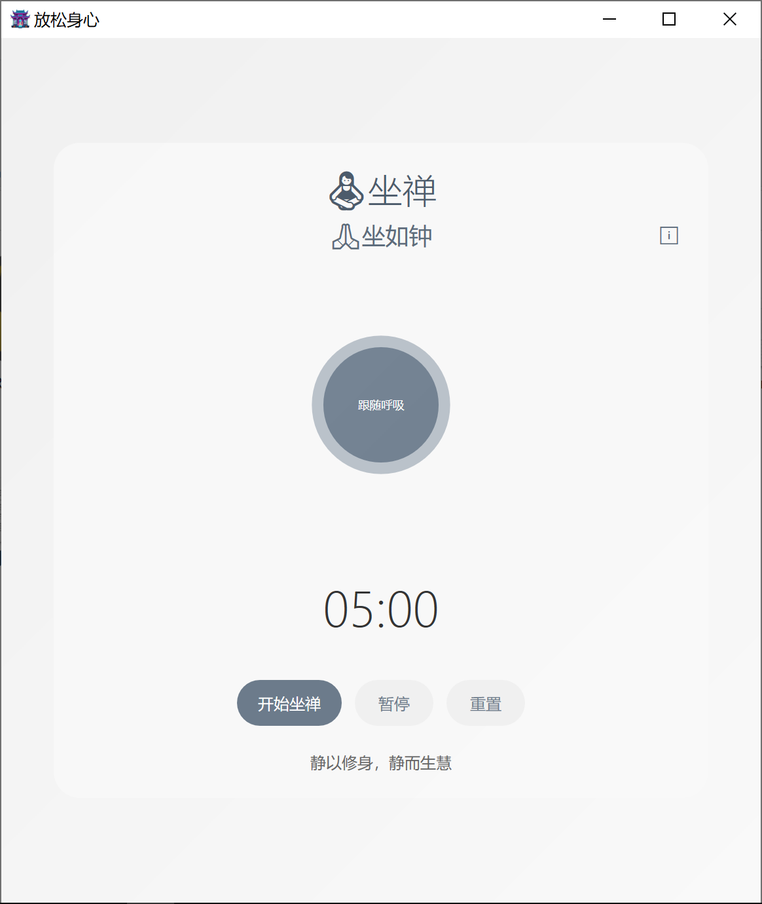
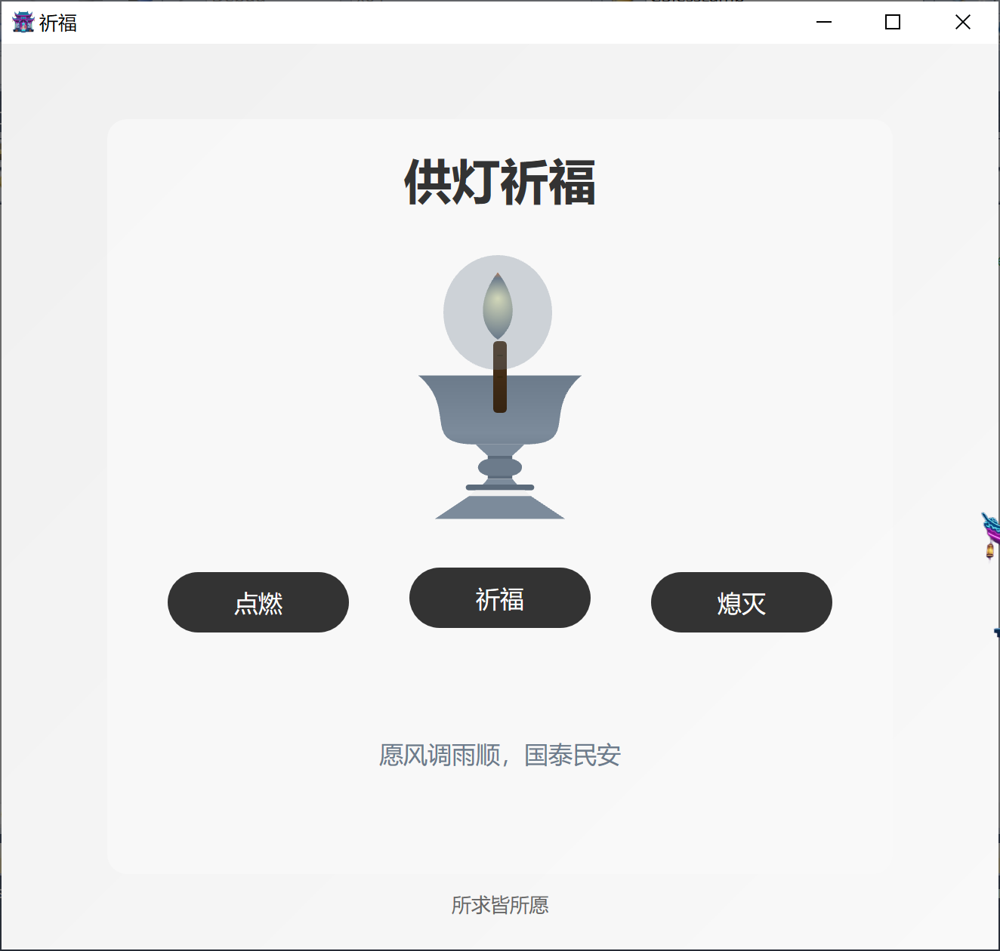
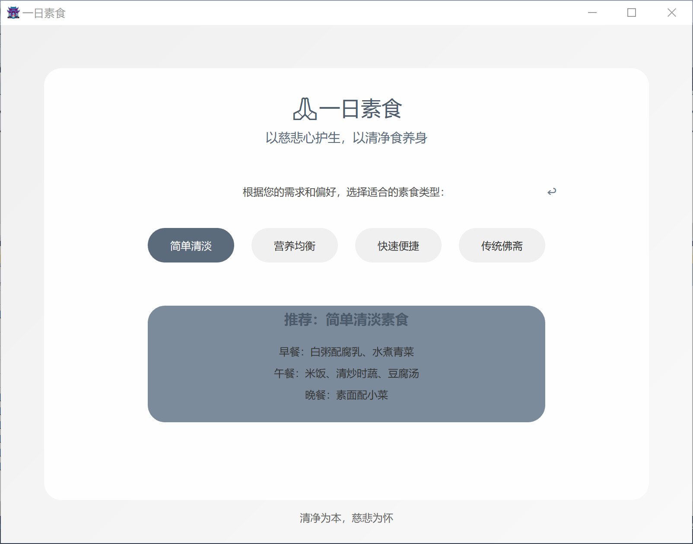

# 赛博禅堂 - 数字时代的禅修伴侣

## 项目简介

赛博禅堂是一个融合传统佛教文化与现代数字技术的禅修应用，旨在为现代人提供便捷、全面的禅修体验。我们致力于通过数字化手段，让更多人能够接触和了解佛教文化，实践禅修生活，在快节奏的现代社会中找到内心的宁静与智慧。

## 功能模块

### 1. 古刹总览

探索世界各地著名古刹的历史文化与建筑特色，通过精美的图片和详细的介绍，感受佛教建筑的庄严与美感。从中国的四大佛教名山到东南亚的佛国圣地，带您领略不同地域佛教文化的独特魅力。

### 2. 古刹介绍

提供详细的古刹介绍，包括历史沿革、建筑特色、文化内涵等。通过图文并茂的形式，让您深入了解每一座古刹的独特魅力和精神价值。

### 4. 禅院-殿堂

深入介绍禅院中的殿堂结构和功能，包括各个殿堂的布局、供奉的佛像以及宗教仪式的举行场所等，让您更全面地了解禅院的建筑体系。

### 5. 禅院-禅堂

展示禅院中专门用于禅修的场所——禅堂。介绍禅堂的布局、禅修的基本方法和注意事项，为您提供一个了解和实践禅修的窗口。

### 6. 禅院-禅师

介绍禅院中的禅师及其修行故事，分享禅师的智慧和教诲，让您感受到禅修传承的力量和精神魅力。

### 7. 禅院-导图

提供禅院的布局导览图，帮助您了解禅院的整体结构和各个建筑的位置关系，为您的禅院参观提供清晰的指引。

### 8. 禅院-报时

详细介绍禅院的报时系统，包括晨钟暮鼓的意义和时间安排，让您了解禅院的日常作息和修行节奏。

### 9. 诸佛介绍

详细介绍佛教中的诸佛菩萨，包括其象征意义、经典故事和信仰内涵。从释迦牟尼佛到阿弥陀佛，从观音菩萨到文殊菩萨，帮助您更深入地了解佛教文化的核心内容。

### 10. 藏经阁

数字化的佛教经典宝库，提供各类佛经的阅读与学习。从《心经》到《金刚经》，从《华严经》到《法华经》，让经典智慧触手可及，为您的修行之路提供智慧指引。

### 11. AI解心经

利用人工智能技术，为您解读《心经》的深刻内涵。通过现代科技与传统经典的结合，让您更轻松地理解和领悟心经的智慧。

### 12. AI解金刚经

借助人工智能技术，为您解析《金刚经》的精髓。通过通俗易懂的解释和现代视角的解读，帮助您更好地理解这部重要的佛教经典。

### 13. 佛偈百则

精选百则佛偈，蕴含深刻的人生智慧。每日阅读一则，修身养性，感悟佛法的真谛。这些简短而有力的智慧语句，将为您的日常生活带来启示与指引。

### 14. 今日守戒

提供日常持戒提醒与指导，帮助修行者培养良好的行为习惯和道德品质。通过每日的持戒实践，培养正念，净化心灵，逐步提升自己的修行境界。

### 16. 禅修-坐禅

介绍坐禅的基本方法和技巧，包括坐姿、呼吸方法和观照对象等。通过详细的指导，帮助您掌握正确的坐禅方法，开启禅修之旅。

### 17. 禅修-立禅

展示立禅的修行方法，适合那些无法长时间坐禅的修行者。通过站立的姿势进行禅修，同样可以达到宁静身心、培养正念的效果。

### 18. 祈福

提供在线祈福功能，让您可以通过数字平台表达自己的祈愿和祝福。无论是为自己还是为他人祈福，都能在这里找到心灵的寄托。

### 19. 行善-布施

介绍佛教中的布施理念和实践方法，鼓励用户通过各种方式践行布施，培养慈悲心和舍心，积累福德。

### 20. 行善-放生

展示佛教中的放生理念和实践，强调对生命的尊重和爱护。通过放生活动，培养慈悲心，感悟生命的平等与珍贵。

### 21. 素食

介绍佛教素食的理念和实践，提供健康素食的食谱和营养知识。通过素食实践，培养慈悲心，同时获得健康的生活方式。

### 22. 功德统计

记录用户的修行活动和功德积累，通过数据可视化展示修行进度。看到自己的成长与进步，激励您持续修行，不断提升自己的精神境界。

### 23. 设置

个性化应用设置，包括提醒时间、界面风格等。根据个人喜好定制修行体验，让应用更好地适应您的生活节奏和修行需求。

### 24. 关于

应用的基本信息、版本说明和开发者介绍。了解应用的背景和理念，感受开发者对佛教文化的热爱与传承之心。

## 设计理念

赛博禅堂以"科技赋能修行"为核心理念，融合传统与现代，致力于：

- **便捷性**：随时随地进行禅修和学习，打破时间和空间的限制
- **全面性**：涵盖佛教文化的多个方面，为用户提供全方位的修行支持
- **互动性**：通过数字手段增强用户体验，让修行更加生动有趣
- **传承性**：弘扬和传承佛教传统文化，让古老的智慧在现代社会焕发新的生命力
- **实用性**：结合现代生活需求，为用户提供切实可行的修行方法和指导
- **创新性**：利用现代科技（如AI）为传统佛教文化注入新的活力和解读视角

## 使用指南

1. **开启修行之旅**：打开应用后，在主界面选择想要使用的功能模块
2. **建立日常习惯**：对于需要日常使用的功能（如今日守戒、禅院报时），建议在设置中开启提醒
3. **追踪修行进度**：定期使用功德统计功能查看修行进度，了解自己的成长轨迹
4. **深入学习经典**：利用藏经阁、AI解经和佛偈百则进行日常学习和反思，丰富自己的精神世界
5. **实践禅修方法**：通过坐禅、立禅等模块学习和实践禅修技巧，培养内心的宁静
6. **参与行善活动**：通过布施、放生等模块践行佛教的慈悲理念，积累福德
7. **探索文化内涵**：通过古刹总览、殿堂、禅院等模块，深入了解佛教文化的丰富内涵

## 结语

在这个快节奏的数字时代，我们常常被各种信息和事务所包围，内心难以保持宁静。赛博禅堂希望成为您数字生活中的一片净土，通过现代科技与传统智慧的结合，为您提供一个便捷、全面的禅修平台。

愿每一位使用者都能在修行中获得成长与感悟，找到内心的平静与智慧，让佛法的光明照亮生活的每一个角落。

---

*愿以此功德，庄严佛净土。上报四重恩，下济三途苦。*